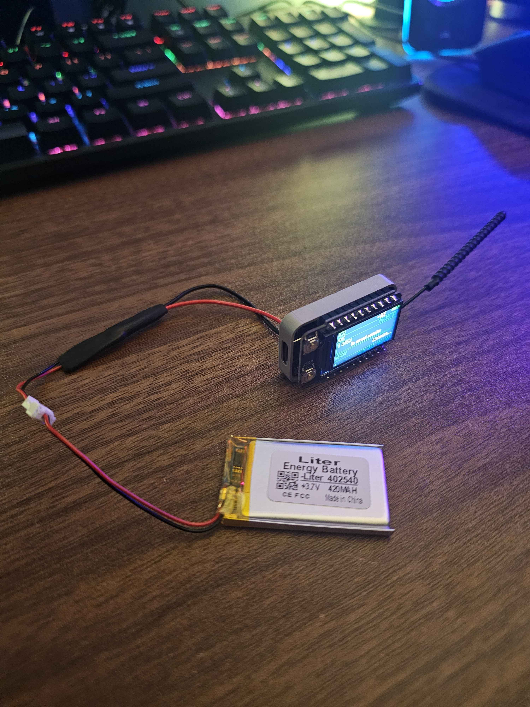
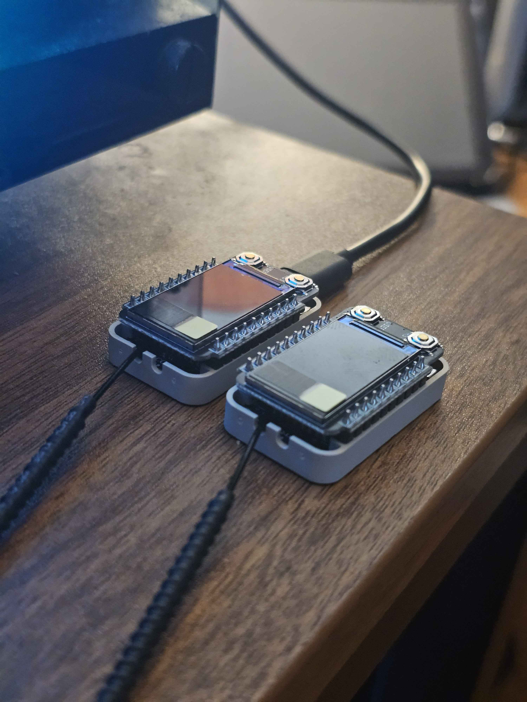

# RadioCore²-RCC6

MeshCore Companion Bluetooth firmware for the **Heltec RadioCore RCC6** with its native **220×128 NV3001B TFT**.

[](https://github.com/n30nex/RadioCore2-RCC6/releases)
[](license.txt)
[](#supported-hardware)

> **1.0 RC1 is a release candidate.** Display, USB stability, BLE advertising, secure PIN pairing, companion synchronization, disconnect/re-advertise, and reconnect were validated on physical RCC6 hardware. End-to-end LoRa field qualification and every notification-failure path remain RC work.

## On-device UI

<p align="center">
  
</p>

<p align="center"><em>Neon Pocket dashboard running on a battery-powered RadioCore RCC6.</em></p>

<details>
<summary>RadioCore hardware</summary>

<p align="center">
  
</p>

</details>

## What RC1 adds

- Native landscape **220×128** phone-style dashboard for the RCC6 TFT.
- Home cards for unread messages and recent adverts.
- BLE, battery, RF, unread, RX/TX, RSSI, and SNR status at a glance.
- Recent nodes, radio settings, Bluetooth, Advert, Power, and message views.
- Color-coded visual notifications for messages, nearby nodes, BLE state, adverts, and low battery.
- One-button Quick Menu and screen-off/wake behavior.
- Subtle page transitions and notification motion.
- RGB565 framebuffer with 8-row delta flushing; measured RC1 delta frame: **121 ms** versus **342–360 ms** for a full frame.
- Static BLE frame queues sized for companion synchronization bursts.
- DIO flash mode for RCC6 compatibility.

## Controls

| Action | Result |
|---|---|
| Press while screen is off | Wake the display; the press is consumed |
| Press while screen is on | Next page or next menu item |
| Hold | Open Quick Menu |
| Press in Quick Menu | Move the highlight |
| Hold in Quick Menu | Select the highlighted action |

Wait at least eight seconds after boot before using Hold; the early-boot hold remains MeshCore's CLI rescue gesture.

## Supported hardware

- Heltec **RadioCore RCC6** / ESP32-C6
- RCC6 LoRa module configuration used by the upstream `heltec_rcc6` target
- Attached Heltec NV3001B **220×128 TFT**
- BLE companion mode

> [!CAUTION]
> This build targets **RCC6 only**. Do not flash it onto RadioCore RC32, RC52, or unrelated ESP32 boards.

Attach a suitable antenna before transmitting. For battery use, use a protected single-cell 3.7 V Li-ion/LiPo pack and verify that the pack permits the board's configured charging current before charging it from USB.

## Download 1.0 RC1

Download assets from the [1.0 RC1 release](https://github.com/n30nex/RadioCore2-RCC6/releases/tag/v1.0.0-rc.1).

| File | Use | Flash offset | Settings |
|---|---|---:|---|
| `RadioCore2-RCC6-1.0-RC1-app.bin` | Recommended update for an already provisioned RCC6 | `0x10000` | Preserved |
| `RadioCore2-RCC6-1.0-RC1-full-recovery-wipes-settings.bin` | Complete bootloader/partition/app recovery image | `0x0` | **Erased** |
| `SHA256SUMS.txt` | Release integrity checks | — | — |

### Recommended: settings-preserving update

Install the current [Espressif esptool](https://docs.espressif.com/projects/esptool/en/latest/esp32c6/):

```shell
python -m pip install --upgrade esptool
```

Replace `COM21` with your RCC6 port:

```shell
esptool --chip esp32c6 --port COM21 write-flash 0x10000 RadioCore2-RCC6-1.0-RC1-app.bin
esptool --chip esp32c6 --port COM21 verify-flash 0x10000 RadioCore2-RCC6-1.0-RC1-app.bin
```

This writes only the application partition. It does not erase the existing node identity, contacts, channels, pairing PIN, or other persisted settings.

### Full recovery

> [!WARNING]
> The full-recovery image overwrites the complete merged image range and **wipes persisted MeshCore identity, settings, and BLE bonds**. Back up anything important first. After recovery, forget the old bond on the phone and pair again using the PIN currently shown on the TFT.

```shell
esptool --chip esp32c6 --port COM21 write-flash 0x0 RadioCore2-RCC6-1.0-RC1-full-recovery-wipes-settings.bin
esptool --chip esp32c6 --port COM21 verify-flash 0x0 RadioCore2-RCC6-1.0-RC1-full-recovery-wipes-settings.bin
```

Do not add `erase-flash` or `--erase-all` to the app-only update.

## Build from source

This repository is based on MeshCore `v1.16.0` development source at upstream commit `fff37407652534d2077d121a7e51c920ec937bcb`.

```shell
git clone https://github.com/n30nex/RadioCore2-RCC6.git
cd RadioCore2-RCC6
pio run -e heltec_rcc6_companion_radio_ble
```

The application binary is produced under:

```text
.pio/build/heltec_rcc6_companion_radio_ble/firmware.bin
```

## RC1 validation

Validated on physical hardware:

- Exact ESP32-C6 USB identity and DIO firmware header.
- App-only flash at `0x10000` with byte-for-byte `verify-flash` success.
- Framebuffer allocation: 56,320 bytes.
- Full TFT flush: 342–360 ms; five-band delta flush: 121 ms.
- Stable USB enumeration across repeated observation windows and manual resets.
- BLE advertisement as `MeshCore-<node name>` with Nordic UART service `6E400001-B5A3-F393-E0A9-E50E24DCCA9E`.
- Secure six-digit PIN authentication, node load in the companion app, disconnect, re-advertise, and reconnect.
- Native landscape UI and Quick Menu opening on the device.
- Battery-powered boot and display operation.

Still to qualify before final 1.0:

- End-to-end LoRa RX/TX receipts with a second radio.
- Complete one-button action matrix.
- Every notification color and animation path.
- Controlled low-battery and transmit-failure paths.
- Measured battery runtime and charging qualification.

## Upstream and license

RadioCore²-RCC6 is a community firmware build, not an official Heltec or MeshCore release.

It is built on [MeshCore](https://github.com/meshcore-dev/MeshCore) and retains the upstream MIT license and copyright notice in [`license.txt`](license.txt). Dependency licenses and exact source pointers are listed in [`THIRD_PARTY_NOTICES.md`](THIRD_PARTY_NOTICES.md). Thanks to the MeshCore contributors and Heltec RadioCore beta community.

## Contributing

Please include the exact RCC6 hardware revision, firmware release, radio region/settings, and reproduction steps with bug reports. Never post private keys, pairing PINs, channel secrets, or full device backups.
