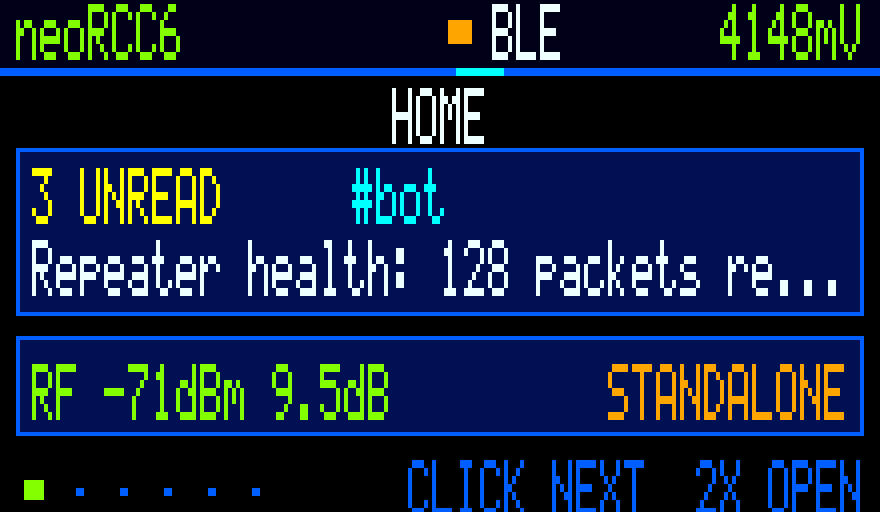
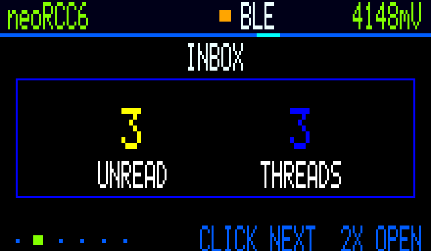
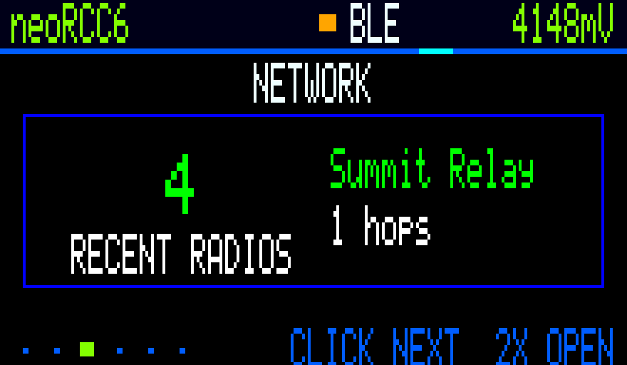
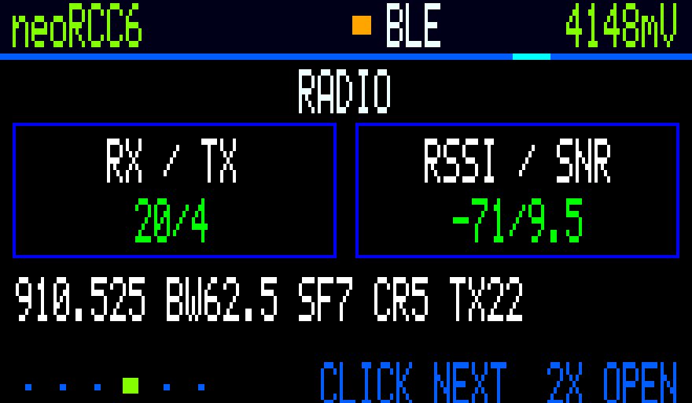
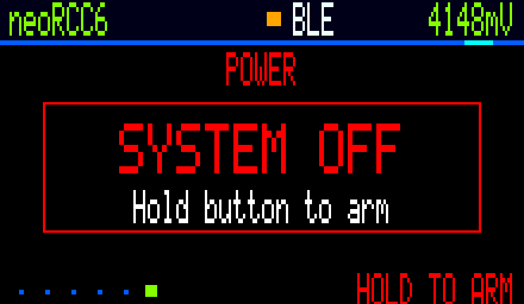

<p align="center">
  
</p>

# NeonPocketMC-RCC6

Experimental MeshCore **1.17.1** companion firmware for the **Heltec RadioCore RCC6** with its attached **220×128 NV3001B TFT**.

> [!CAUTION]
> **RCC6 only—do not flash RC32, RC52, or other RadioCore hardware.** Attach a suitable antenna before transmitting.

<p align="center">
  
</p>

## Demo-scene startup

<p align="center">
  
</p>

This is a direct, checksum-verified capture of the RCC6 220×128 framebuffer running the production renderer—not a browser mockup. Exact frame provenance is maintained in the [unified gallery](https://github.com/n30nex/NeonPocketMC/tree/main/docs/images/demoscene).

## Release status

The proven v1 line remains available as [`v1.2.0-rc.2`](https://github.com/n30nex/NeonPocketMC-RCC6/releases/tag/v1.2.0-rc.2). Ultimate Companion v2 is a separate experimental `v2.0.0-rc.1` candidate; it does not replace the stable images. Use only files attached to a named release—short-lived Actions artifacts are development builds.

## Ultimate Companion v2

Ultimate v2 ships as two separate images. They share the same standalone six-area NeonPocket experience and never run Bluetooth and Wi-Fi at the same time:

| Target | Connectivity |
| --- | --- |
| `heltec_rcc6_ultimate_companion_ble` | Standard secure MeshCore BLE companion |
| `heltec_rcc6_ultimate_companion_web` | WPA setup AP, local 2.4 GHz Wi-Fi, authenticated WebUI, and TCP/5000 |

The 220×128 TFT runs through a 28,160-byte indexed framebuffer with 20×8 changed-tile transfers. It renders at 15 FPS while awake, uses eased page motion, and fails closed if its framebuffer, palette, or post-service 32 KiB memory gate cannot be allocated. The demo-scene startup now follows real display, radio, storage/history, transport, and memory stages; fatal startup errors remain visible in the same branded renderer.

The on-device experience includes:

- Home, Inbox, Network Explorer, Radio/Diagnostics, Tools, and Power areas;
- direct and `#channel` threads with persistent local unread state and full paged messages;
- 8 editable quick phrases plus an optional row/column one-switch keyboard;
- recent radios on the configured MeshCore preset only—no automatic retuning;
- live RF, queue, heap, storage, battery, display-transfer, error, and airtime metrics;
- two hours of minute samples in RAM and 168 persisted hourly buckets;
- an independent `/np/` message journal with Off, 128, 512, or 2,048-record retention;
- NDJSON history export and separately confirmed erasure.

History is stored as plaintext, matching normal MeshCore storage. Private-notification mode hides message bodies while the screen is locked; it does not encrypt the journal. Lowering retention keeps the newest records. Selecting Off stops new writes and does not erase existing history.

## Ultimate on-device gallery

These are direct, CRC-checked captures of the framebuffer rendered by the connected RCC6—not browser mockups or design comps. They retain the native pixel character of the 220×128 panel and are enlarged 4× with nearest-neighbor scaling.

| Home | Inbox |
| --- | --- |
|  |  |

| Network Explorer | Radio |
| --- | --- |
|  |  |

| Tools | Power |
| --- | --- |
|  |  |

Capture provenance and the unscaled source-frame details are recorded in [`docs/images/ultimate/README.md`](docs/images/ultimate/README.md).

The Web image adds an Ultimate dashboard, charts, history/settings APIs, explicit browser-location transfer, and signed app-only OTA. Location is requested only after pressing the Location button, displayed for confirmation, and then written to the existing MeshCore latitude/longitude preferences. No background tracking is performed.

> [!WARNING]
> **TCP port 5000 is always enabled in the Ultimate Web image. Any client on the trusted local network can access the complete MeshCore companion/admin protocol, including sensitive administration commands.** HTTP authentication and the browser API allowlist do not protect raw TCP. Use Web mode only on a trusted private LAN.

## Stable v1 firmware choices

The repository builds two separate application images:

| Target | Purpose |
| --- | --- |
| `heltec_rcc6_companion_radio_ble` | Secure BLE companion for the MeshCore phone app |
| `heltec_rcc6_companion_radio_web_ap` | Offline phone/desktop WebUI, setup AP, local 2.4 GHz Wi-Fi, and trusted-LAN TCP/5000 |

Both images include the native NeonPocket display, animated branded startup, local direct and `#channel` unread inbox, Nearby and Radio views, flood-scoped Advert action, 60-second screen timeout, battery warning, and one-button controls. RCC6 builds also add a cached Diagnostics page and a six-choice auto-scanning Quick Reply page that replies to the latest direct sender or channel without blocking radio callbacks.

This branch is based on MeshCore **1.17.1**. The Ultimate implementation started from exact NeonPocketMC-RCC6 main commit `bbf585e65afb1044d2ed91079f96d3b0e3325279`; each build embeds its own exact Git SHA.

## Storage behavior

Earlier RCC6 builds could stop at `STORAGE ERROR` on a new or fully recovered device because an erased SPIFFS partition is not yet a filesystem. This version distinguishes that safe first-boot state from damaged data:

- a valid filesystem mounts without modification;
- an entirely erased (`0xFF`) SPIFFS partition is formatted once and boot continues;
- a nonblank partition that will not mount is **never formatted automatically** and shows `STORAGE ERROR / Data not erased`.

Firmware updates therefore preserve the MeshCore identity, contacts, channels, and preferences stored in SPIFFS.

## Controls

| Gesture | Result |
| --- | --- |
| First gesture while screen is off | Wake only; the gesture is consumed |
| Single press | Next page, inbox item, or message page |
| Double press | Current-page action: Inbox, BLE/network toggle, or Advert |
| Long hold | Show Power confirmation |
| Second hold within eight seconds | Power off after button release |

Wait at least eight seconds after boot before using Hold; the early-boot hold remains MeshCore's CLI rescue gesture.

On **Quick Reply**, wait for the desired phrase, double-press to select it, then double-press again to send. The page fails closed when no valid recent message target exists. Diagnostics samples uptime, battery, packet counters, radio errors, noise floor, and heap every five seconds rather than touching the radio during display rendering.

## Web/AP mode

On first boot, Web/AP firmware starts a WPA-protected `MeshCore-<node>` setup network. The TFT shows the SSID, device password, and `192.168.4.1`. Open:

```text
http://192.168.4.1
```

The Home-page setup wizard can join a local **2.4 GHz** Wi-Fi network. After restart, the TFT shows the assigned LAN address. Station-mode HTTP uses username `meshcore` and the same device password.

TCP port 5000 exposes the complete MeshCore companion/admin protocol without separate application authentication. Enable local-network mode only on a trusted private LAN.

## Flashing

The 1.2 RC2 release contains an application image and a merged recovery image for each mode:

- `NeonPocketMC-RCC6-1.2-RC2-BLE-app.bin`
- `NeonPocketMC-RCC6-1.2-RC2-BLE-full-recovery-preserves-meshcore-settings.bin`
- `NeonPocketMC-RCC6-1.2-RC2-WebAP-app.bin`
- `NeonPocketMC-RCC6-1.2-RC2-WebAP-full-recovery-preserves-meshcore-settings.bin`

- Normal install/update: flash the application `.bin` at **`0x10000`**.
- Bootloader/partition recovery only: flash the merged recovery `.bin` at **`0x0`**.
- Do **not** erase the whole flash. Both paths leave the SPIFFS data partition outside the written image.

Example with current `esptool`:

```text
python -m esptool --chip esp32c6 --port COM21 write-flash 0x10000 NeonPocketMC-RCC6-1.2-RC2-BLE-app.bin
```

Replace `COM21` with the port actually shown by your computer. Use the Web/AP filename for Web mode. Verify the release checksums before flashing.

### Ultimate v2 installation and recovery

Normal Ultimate installation remains application-only at `0x10000`; it does not replace the bootloader, partition table, NVS, or SPIFFS:

```text
python -m esptool --chip esp32c6 --port COM21 write-flash 0x10000 NeonPocketMC-RCC6-Ultimate-v2.0.0-rc.1-BLE-app.bin
```

Use the Web filename for Web mode. Identity-preserving merged recovery images are provided separately and are for bootloader/partition recovery at `0x0`, not ordinary updates. Never erase the whole chip.

The WebUI accepts only a signed `NeonPocketMC-RCC6-Ultimate-Web-v2.0.0-rc.1.npu` package. Firmware verifies the RCC6 target, Web mode, application length, SHA-256, and Ed25519 signature before selecting the inactive OTA application slot. The existing bootloader does not guarantee automatic rollback from a boot-breaking app; keep USB access and the matching app/recovery images available. BLE firmware has no Web OTA and is updated over USB only.

## Build

GitHub Actions is the supported build path. The `RCC6 Companion Build` workflow checks out the exact branch SHA, verifies the embedded WebUI, builds both environments, validates the ESP32 images, and publishes short-lived exact-SHA artifacts.

Local commands, if required:

```text
pio run -e heltec_rcc6_companion_radio_ble
pio run -e heltec_rcc6_companion_radio_web_ap
pio run -e heltec_rcc6_ultimate_companion_ble
pio run -e heltec_rcc6_ultimate_companion_web
```

Ultimate USB CLI Rescue adds `np status`, NDJSON history export, confirmed history clear, retention, privacy, cadence, and quick-phrase commands. Enter CLI Rescue with the normal early-boot Hold gesture; type `help` and see [the Ultimate v2 guide](docs/releases/2.0-RC1.md).

## Hardware and power notes

- ESP32-C6 + SX1262 RadioCore RCC6
- NV3001B TFT in native 220×128 landscape mode
- DIO flash mode
- Protected single-cell 3.7 V Li-ion/LiPo only on `VBAT`; never connect an unregulated solar panel directly
- Low-battery warning below 3.45 V, cleared above 3.60 V; no automatic low-voltage shutdown

## Upstream and license

NeonPocketMC-RCC6 is community firmware, not an official Heltec or MeshCore release. It retains the upstream license in [`license.txt`](license.txt); dependency notices and redistribution references are in [`THIRD_PARTY_NOTICES.md`](THIRD_PARTY_NOTICES.md) and [`LICENSES/README.md`](LICENSES/README.md).

When reporting a problem, include the exact release filename, flash address/tool, RCC6 hardware revision, and a 115200-baud boot log. Never publish private keys, channel secrets, Wi-Fi passwords, or full flash backups.
