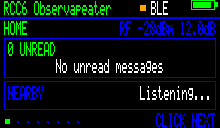
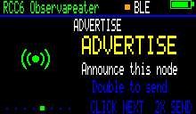

<p align="center">
  
</p>

# NeonPocketMC-RCC6

Experimental MeshCore 1.17 companion firmware for the **Heltec RadioCore RCC6** with its attached **220×128 NV3001B TFT**.

> [!CAUTION]
> **RCC6 only—do not flash RC32, RC52, or other RadioCore hardware.** Attach a suitable antenna before transmitting.

<p align="center">
  
</p>

## Release status

The current experimental release is [`v1.2.0-rc.1`](https://github.com/n30nex/NeonPocketMC-RCC6/releases/tag/v1.2.0-rc.1). It adds the animated NeonPocketMC startup, Diagnostics, and Quick Reply to both companion modes. Use only files attached to that release; short-lived Actions artifacts are development builds.

## Live interface

These are direct, pixel-for-pixel captures of the 220×128 RGB565 framebuffer running on an RCC6—not mockups. They were captured from a temporary diagnostics build based on this repository's exact [`v1.2.0-rc.1`](https://github.com/n30nex/NeonPocketMC-RCC6/releases/tag/v1.2.0-rc.1) source; the capture hook is not included in public firmware.

<table>
  <tr>
    <td align="center"><br><strong>Home</strong></td>
    <td align="center"><br><strong>Nearby</strong></td>
  </tr>
  <tr>
    <td align="center"><br><strong>Radio statistics</strong></td>
    <td align="center"><br><strong>Mesh advert</strong></td>
  </tr>
  <tr>
    <td align="center"><br><strong>One-button Quick Reply</strong></td>
    <td align="center"><br><strong>Diagnostics</strong></td>
  </tr>
  <tr>
    <td colspan="2" align="center"><br><strong>Power confirmation</strong></td>
  </tr>
</table>

Capture provenance and checksums are recorded in [`docs/images/rcc6-ui/README.md`](docs/images/rcc6-ui/README.md).

## Firmware choices

The repository builds two separate application images:

| Target | Purpose |
| --- | --- |
| `heltec_rcc6_companion_radio_ble` | Secure BLE companion for the MeshCore phone app |
| `heltec_rcc6_companion_radio_web_ap` | Offline phone/desktop WebUI, setup AP, local 2.4 GHz Wi-Fi, and trusted-LAN TCP/5000 |

Both images include the native NeonPocket display, animated branded startup, local direct and `#channel` unread inbox, Nearby and Radio views, flood-scoped Advert action, 60-second screen timeout, battery warning, and one-button controls. RCC6 builds also add a cached Diagnostics page and a six-choice auto-scanning Quick Reply page that replies to the latest direct sender or channel without blocking radio callbacks.

This port is based on MeshCore **1.17.0** at exact upstream commit [`727fc0512ce08bfd7b499e46daa7fca6eeec730d`](https://github.com/meshcore-dev/MeshCore/commit/727fc0512ce08bfd7b499e46daa7fca6eeec730d).

## Storage behavior

Earlier RCC6 builds could stop at `STORAGE ERROR` on a new or fully recovered device because an erased SPIFFS partition is not yet a filesystem. This version distinguishes that safe first-boot state from damaged data:

- a valid filesystem mounts without modification;
- an entirely erased (`0xFF`) SPIFFS partition is formatted once and boot continues;
- a nonblank partition that will not mount is **never formatted automatically** and shows `STORAGE ERROR / Data not erased`.

Firmware updates therefore preserve the MeshCore identity, contacts, channels, and preferences stored in SPIFFS.

## Controls

| Gesture | Result |
| --- | --- |
| First gesture while screen is off | Wake only; the gesture is consumed |
| Single press | Next page, inbox item, or message page |
| Double press | Current-page action: Inbox, BLE/network toggle, or Advert |
| Long hold | Show Power confirmation |
| Second hold within eight seconds | Power off after button release |

Wait at least eight seconds after boot before using Hold; the early-boot hold remains MeshCore's CLI rescue gesture.

On **Quick Reply**, wait for the desired phrase, double-press to select it, then double-press again to send. The page fails closed when no valid recent message target exists. Diagnostics samples uptime, battery, packet counters, radio errors, noise floor, and heap every five seconds rather than touching the radio during display rendering.

## Web/AP mode

On first boot, Web/AP firmware starts a WPA-protected `MeshCore-<node>` setup network. The TFT shows the SSID, device password, and `192.168.4.1`. Open:

```text
http://192.168.4.1
```

The Home-page setup wizard can join a local **2.4 GHz** Wi-Fi network. After restart, the TFT shows the assigned LAN address. Station-mode HTTP uses username `meshcore` and the same device password.

TCP port 5000 exposes the complete MeshCore companion/admin protocol without separate application authentication. Enable local-network mode only on a trusted private LAN.

## Flashing

The 1.2 RC1 release contains an application image and a merged recovery image for each mode:

- `NeonPocketMC-RCC6-1.2-RC1-BLE-app.bin`
- `NeonPocketMC-RCC6-1.2-RC1-BLE-full-recovery-preserves-meshcore-settings.bin`
- `NeonPocketMC-RCC6-1.2-RC1-WebAP-app.bin`
- `NeonPocketMC-RCC6-1.2-RC1-WebAP-full-recovery-preserves-meshcore-settings.bin`

- Normal install/update: flash the application `.bin` at **`0x10000`**.
- Bootloader/partition recovery only: flash the merged recovery `.bin` at **`0x0`**.
- Do **not** erase the whole flash. Both paths leave the SPIFFS data partition outside the written image.

Example with current `esptool`:

```text
python -m esptool --chip esp32c6 --port COM21 write-flash 0x10000 NeonPocketMC-RCC6-1.2-RC1-BLE-app.bin
```

Replace `COM21` with the port actually shown by your computer. Use the Web/AP filename for Web mode. Verify the release checksums before flashing.

## Build

GitHub Actions is the supported build path. The `RCC6 Companion Build` workflow checks out the exact branch SHA, verifies the embedded WebUI, builds both environments, validates the ESP32 images, and publishes short-lived exact-SHA artifacts.

Local commands, if required:

```text
pio run -e heltec_rcc6_companion_radio_ble
pio run -e heltec_rcc6_companion_radio_web_ap
```

## Hardware and power notes

- ESP32-C6 + SX1262 RadioCore RCC6
- NV3001B TFT in native 220×128 landscape mode
- DIO flash mode
- Protected single-cell 3.7 V Li-ion/LiPo only on `VBAT`; never connect an unregulated solar panel directly
- Low-battery warning below 3.45 V, cleared above 3.60 V; no automatic low-voltage shutdown

## Upstream and license

NeonPocketMC-RCC6 is community firmware, not an official Heltec or MeshCore release. It retains the upstream license in [`license.txt`](license.txt); dependency notices and redistribution references are in [`THIRD_PARTY_NOTICES.md`](THIRD_PARTY_NOTICES.md) and [`LICENSES/README.md`](LICENSES/README.md).

When reporting a problem, include the exact release filename, flash address/tool, RCC6 hardware revision, and a 115200-baud boot log. Never publish private keys, channel secrets, Wi-Fi passwords, or full flash backups.
